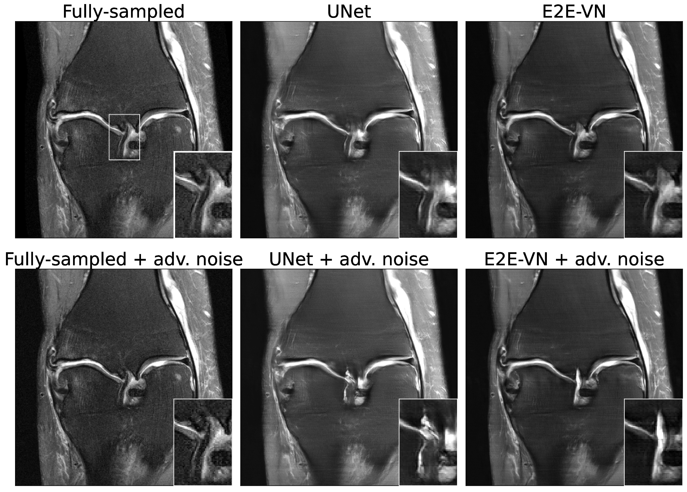
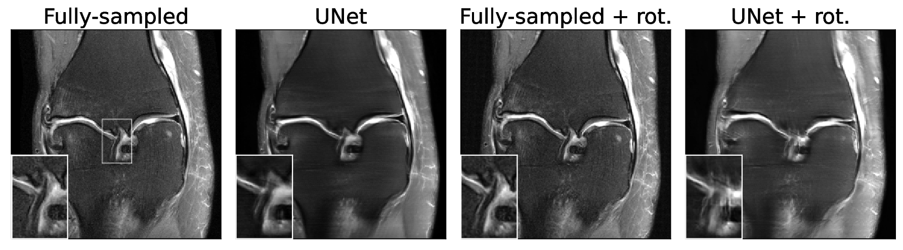

# Adversarial Robustness of MR Image Reconstruction under Realistic Perturbations

This repository contains the code for the paper "Adversarial Robustness of MR Image Reconstruction under Realistic Perturbations" 
that will be presented in the MICCAI-2022 workshop: "Machine Learning for Medical Image Reconstruction".
With this code, you can find realistic perturbations (k-space noise and rotation-angles) that can significantly 
alter the annotated anomalies visible in the MRI-scan.

### Adversarial k-space noise:

### Adversarial rotation angle:


## Requirements
To run the code you will need access to a relatively large GPU like a NVIDIA-V100. This is due to the large model size of the pretrained baseline
models of the fastMRI-repo. 

We tested the code in the following setting:
- NVIDIA-V100
- Cuda 11.3
- Python 3.9

## Installation
This repo uses some functionality from the fastMRI-repo. All necessary packages are defined 
in the requirements.txt file. You can create a fresh environment and install the packages with
the following command:
```
conda create -n advrec python=3.9
pip install -r requirements.txt
```

## How to use the code?
In order to use the code, you need the fastMRI image data of the multicoil-knee validation set. You can ask access to this dataset on the 
fastMRI website: https://fastmri.org/

Once you have downloaded the data, you can execute the code e.g. with the following command:

```
python adversarial.py
--data_path your/fastmri/datapath/raw/knee_multicoil
--mask_type random
--use_dataset_cache_file False
--accelerations 8
--center_fractions 0.04
--loss_name MSE
--relevant_only True
--used_model_array varnet
--used_transform noise
```
This will start the adversarial noise attack and will write the corresponding MSE-errors in a dataframe. 

## Implementation differences
Note that in contrast to the paper, in the current version of the code we conduct the experiments with the original fastMRI-baseline models, that are 
automatically downloaded if you run the code. In contrast to the smaller versions used in the workshop paper, the versions used
in this code are trained on both training and validation set. Therefore, when evaluating on the validation set, the model 
has already seen the datapoints, which might affect the adversarial robustness. However, our experiments have shown that the model
is still susceptible to our perturbations and hence we keep this option for now because of the easy availablility of the fastMRI-models.


# References

If you find the code useful, please consider citing
```bib
@misc{Morshuis2022AdvRec,
  title = {Adversarial Robustness of MR Image Reconstruction under Realistic Perturbations},
  author = {Morshuis, Jan Nikolas and Gatidis, Sergios and Hein, Matthias and Baumgartner, Christian F.},  
  publisher = {arXiv},
  year = {2022},   
  url = {https://arxiv.org/abs/2208.03161},
}
```